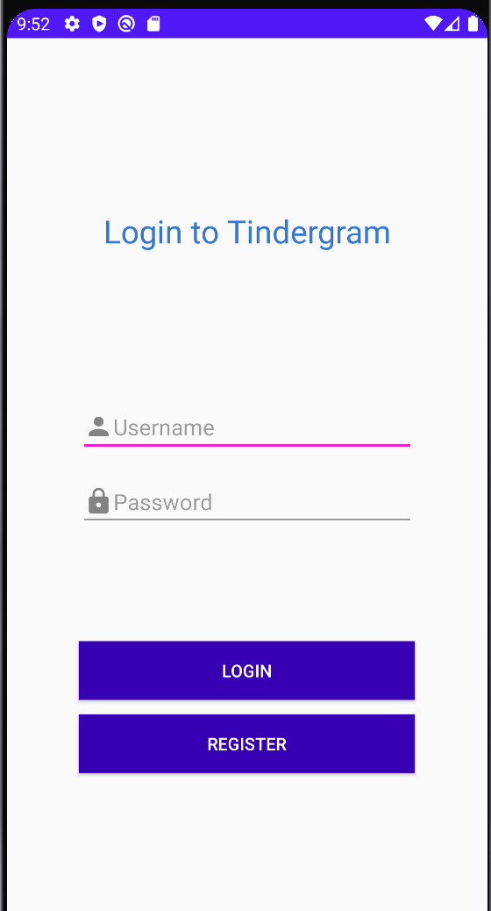
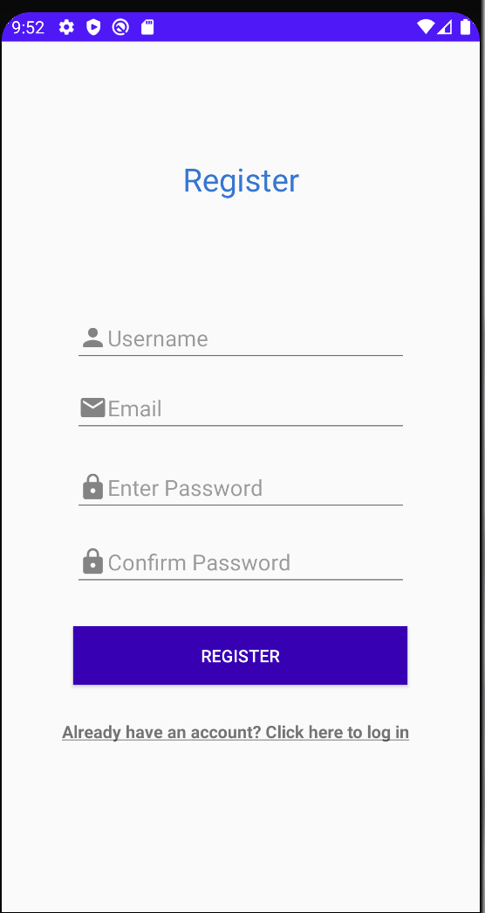
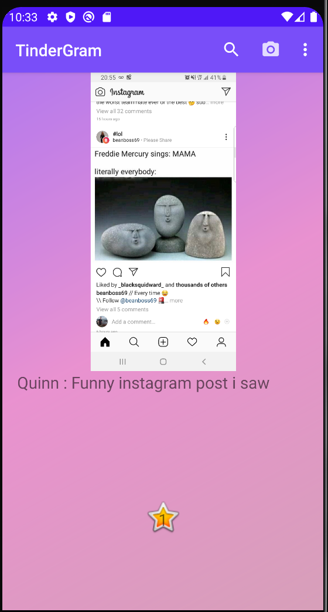
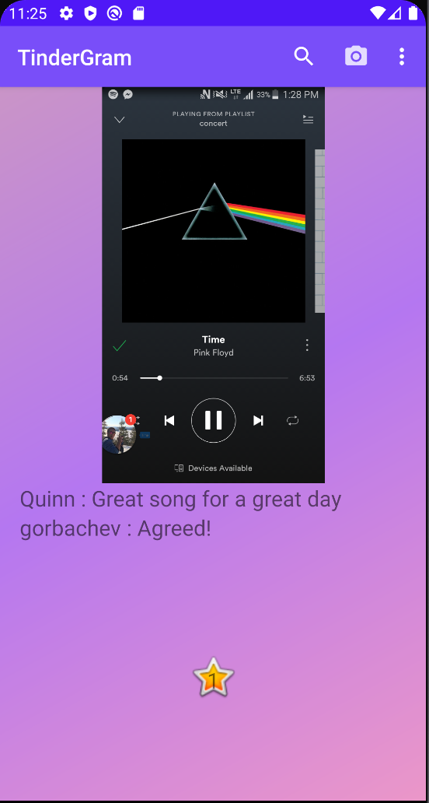
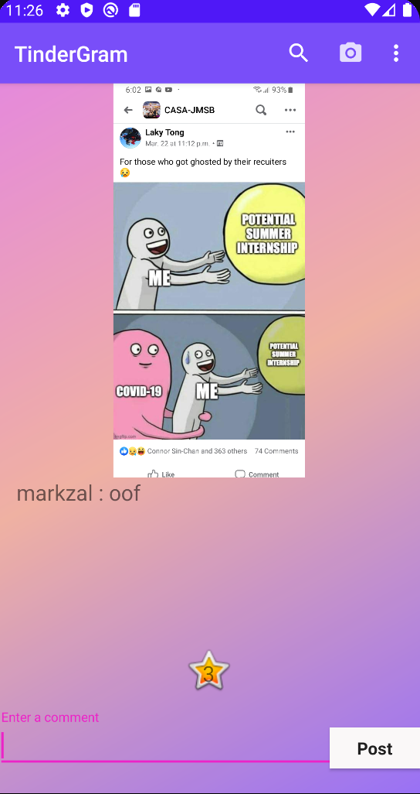
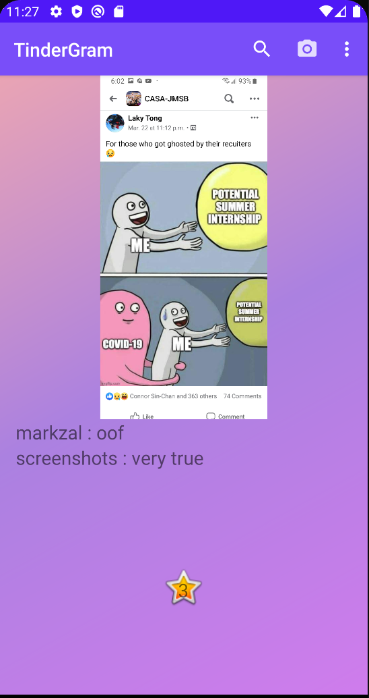
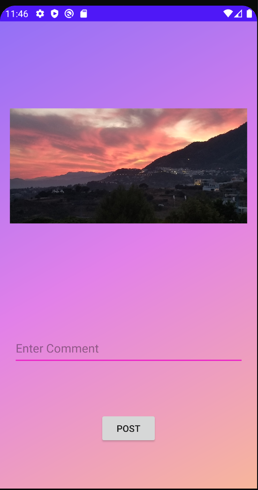
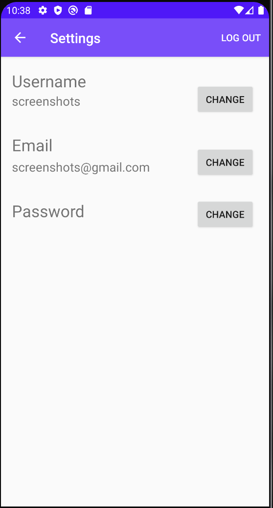
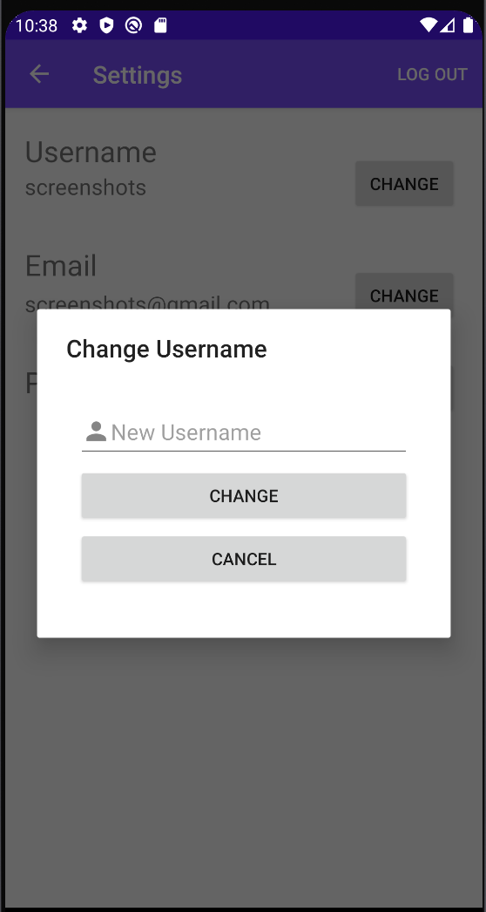

# Tindergram  

## Objective

Develop a simplified version of the Instagram application incorporating the touch gestures of Tinder.

## Project Description

Browsing social media can be a fun way to meet new people, interact with friends and make your opinion and comments known. This web application will allow users to post pictures to their home page and follow friends as well as other people of interest. The application will display a notification whenever another user a person follows posts a new photo. Finally, users will also be able to comment on other users pictures as well as their own.

The application is be a simplified version of the popular app Instagram.

We decided to create a phone application that will be a combination of both instagram and tinder. Essentially since a user could swipe in 4 directions (up, down, left, right). Therefore we will have additional features for those directional swiping possibilites.
These are the swiping features we've implemented:
swipe left = basic scrolling to the next image; 
swipe right = like the picture;
swipe up = comment on the picture;

## Core Features

    - Include ability for users to post a picture to the website.
    - Users can follow each other. 
    - When a user posts a picture, all users who follow them will receive a notification.
    - Include ability for users to leave comments on other users pictures.
    - Ability to navigate pictures using the Tinder swiping motions

## Screenshots of Application in Use

The login screen which allows the user to login with an already created account or to press the "Register" which allows them to create an account.

The register screen which allows users to create an account.

Once logged in, the home screen will display images posted by other users that you are following.

When swiping left, the next image will appear on the home screen.

When swiping up, a comment bar will appear at the bottom of the page.

Once a comment is posted, it will appear with the rest of the comments.

When the camera icon on the toolbar of the home page is pressed, you can select an image to upload and post.

When the icon in the top right corner of the toolbar of the homepage is pressed, the user will have to option to log out or go to the settings page. Below is a picture of the settings page.

When the "Change" button is pressed, the following window will appear for the respective information that is wished to be changed.

## Source Code

[Android App Kotlin Source Code](https://github.com/Quinn-of-England/SOEN341/tree/master/app/src/main/java/com/example/soen341)\
[Android App View Resources (XML)](https://github.com/Quinn-of-England/SOEN341/tree/master/app/src/main/res/layout)\
[Server-Side Code (PHP)](https://github.com/Quinn-of-England/SOEN341/tree/master/server)\
[Unit Tests](https://github.com/Quinn-of-England/SOEN341/tree/master/app/src/androidTest/java/com/example/soen341)\
[Project Architecture Diagram](https://github.com/Quinn-of-England/SOEN341/blob/master/Tindergram%20MVC%20Diagram.pdf)

## Wiki Locations

[Coding Style](https://github.com/Quinn-of-England/SOEN341/wiki/Coding-Styles)\
[Meeting Notes](https://github.com/Quinn-of-England/SOEN341/wiki/Meetings)\
[Story Points, Priority and Risk Definitions](https://github.com/Quinn-of-England/SOEN341/wiki/Story-points-&-Priority-&-Risk)

## Team Members / GitHub Username

    - Mark Zalass / mzal98
    - David Rady / DavidRady
    - Quinn Hogg / Quinn-of-England
    - William Morin-Laberge / WilliamM-L
    - Nikolas Darlas / steamypotato

## Technologies Used

App: Android app, Android Studio with Kotlin

Server: PHP, SQL, XAMPP Server
